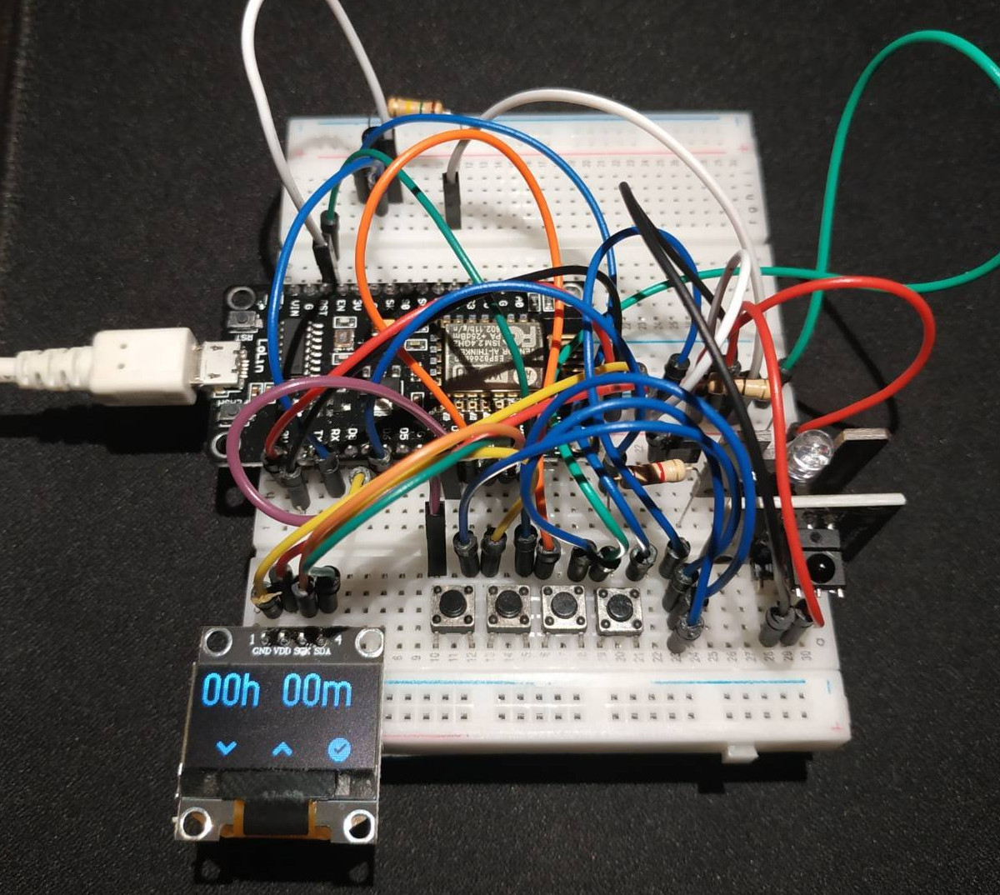

# IR Timer

ESP8266 based infrared timer.  This is a device that allows programming an IR
signal to be sent after an user selected timeout, built with Arduino.

I built this project to program my bedroom fan to shut down an hour later after
I went to sleep.

# Features

- User friendly selection of timeout: for lower values the increment/decrement
  is smaller than for higher values.
- Energy efficient: The ESP8266 stays in deep sleep most of the time, consuming
  very little energy.  It only wakes up at 10 minutes intervals to advance the
  internal state without turning on the display, or at any moment the user
  presses the wakeup button turning on the display.
- Automatic stand by: The ESP8266 will go to sleep mode after 10 seconds of
  inactivity, without losing the state (or the countdown if the timer is
  active).

# Usage

## Time menu
- Press A to decrease countdown time
- Press B to increase countdown time
- Press C to start the countdown

## Countdown
- Press C to cancel countdown

After the countdown, the deadline function is called automatically (sending the
programmed IR signal).

# Photos

## Prototype build

## Screens

||||
|:-:|:-:|:-:|
| startup  | time menu  |  countdown |

# Schematic

# License

GPLv3 (See [LICENSE.txt](LICENSE.txt))
